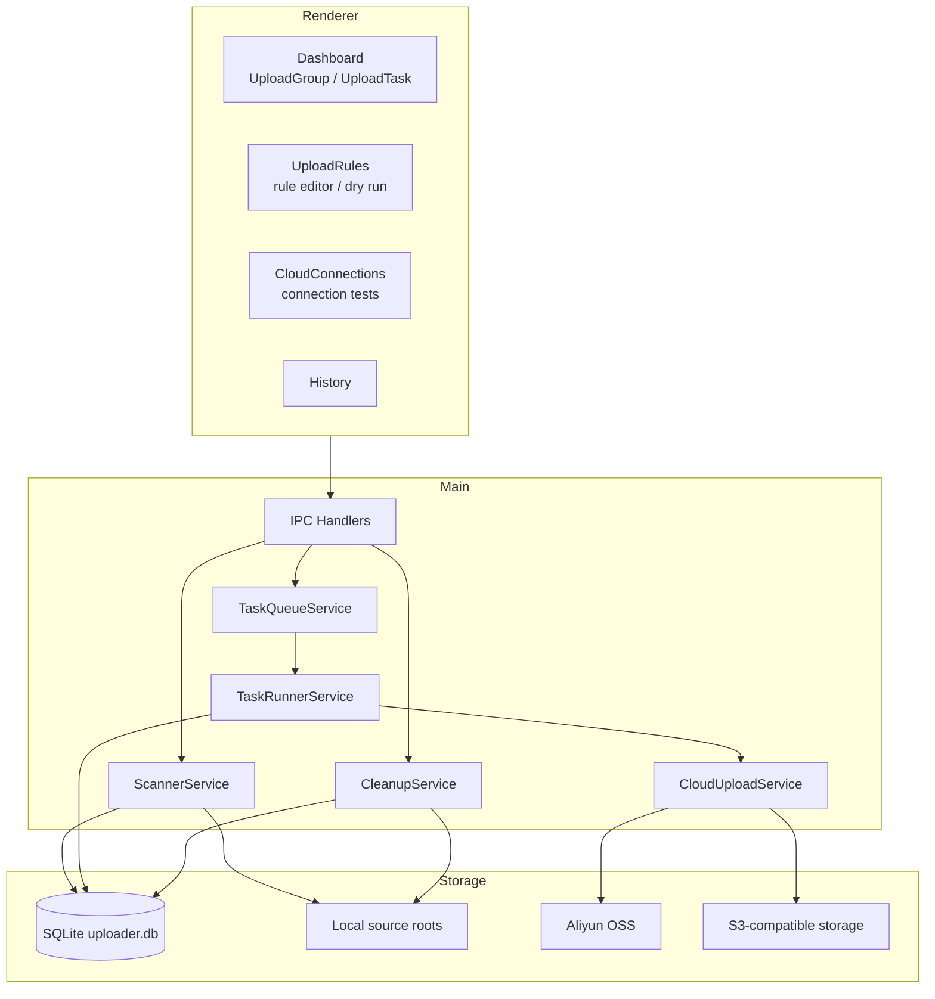

# 架构总览

v3 由 React 渲染进程、Preload 安全桥、Electron 主进程、SQLite、本地文件扫描器和对象
存储适配器组成。渲染进程只通过 IPC 使用主进程能力，不直接访问文件系统、数据库或云端
SDK。

## 核心边界

- `ScannerService`：按启用的 UploadRule 扫描 Source Roots，发现 UploadGroup 和 UploadTask。
- `TaskQueueService`：控制上传 gate、时间窗口、任务级并发和正常退出时的运行中任务中止。
- `TaskRunnerService`：读取任务规则快照，执行过滤、路径映射、上传、重试和进度聚合。
- `CloudUploadService`：按 CloudConnection 类型选择 Aliyun OSS 或 S3-compatible uploader。
- `UploadGroupRepo`：保存 UploadGroup 状态、封账、cleanup claim 和清理安全查询。
- `TaskRepo`：保存逻辑任务、逻辑文件和增量 reconcile 状态。
- `TaskDestinationRepo`：按 `connectionId` 保存任务目标与文件目标状态。
- `CleanupService`：只清理已封账并通过二次验证的本地目录。

## 持久化原则

SQLite 是恢复和查询的主状态源。任务创建时保存 UploadRule 快照，后续编辑规则只影响新任务。
启动时会把中断留下的 `uploading` 任务和文件目标恢复为可重试状态，同时保留已经完成的
destination/file destination。

清理是 fail-safe 流程：先 claim UploadGroup，再禁止 scanner 在该 group 上写入，随后重新
refresh、recalculate、检查 DB 与文件系统内容，最后才执行删除。
